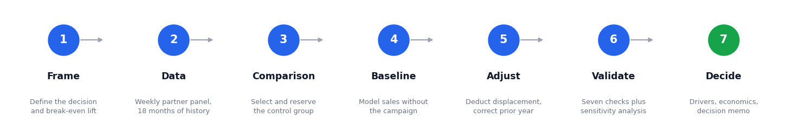
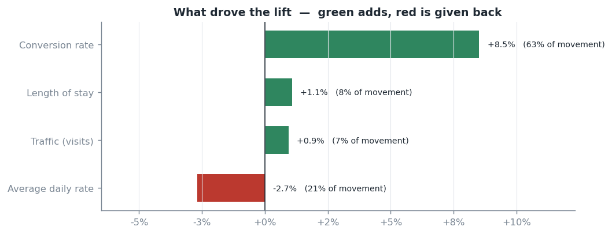
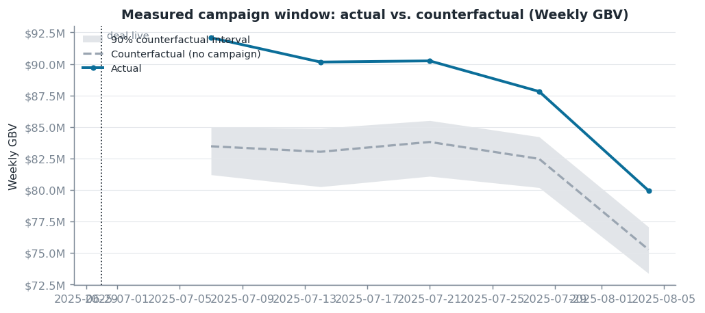
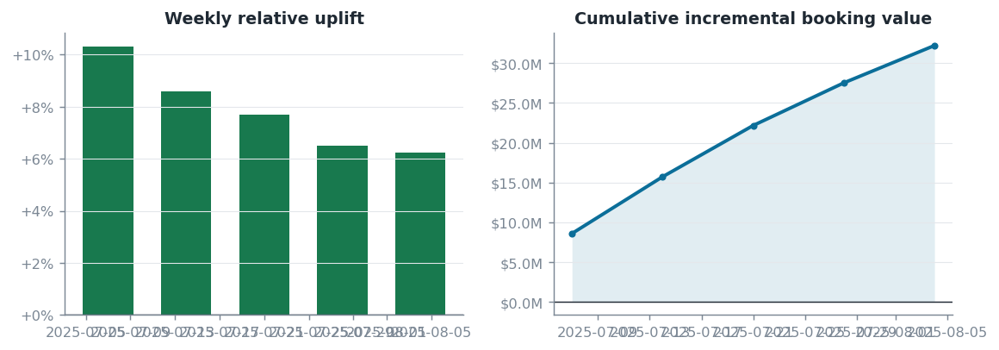
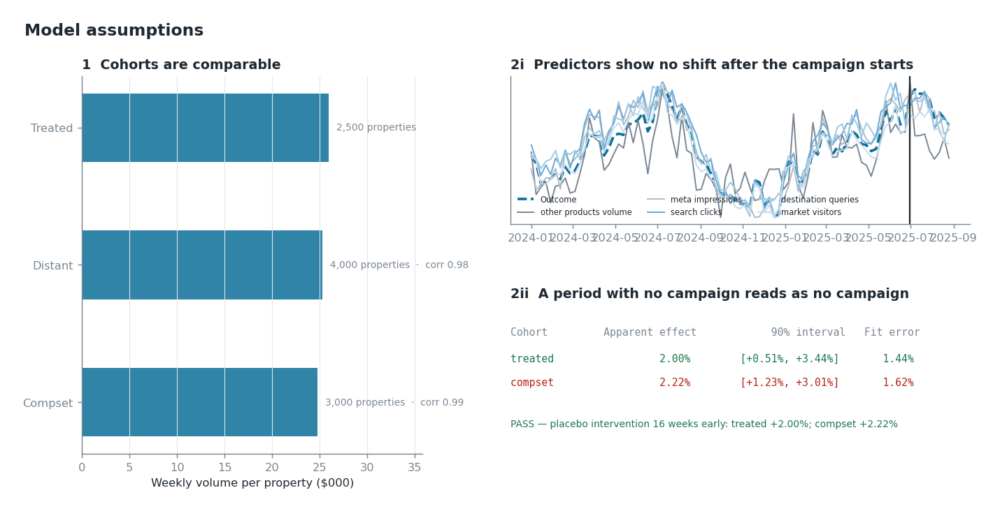
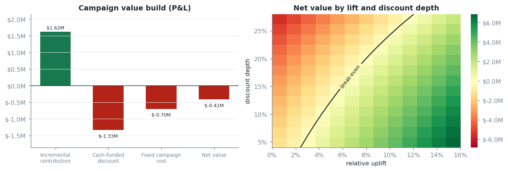

# Campaign Incrementality Measurement

**Aakanksha Baid** — Analytics Strategy Leader · [LinkedIn](https://www.linkedin.com/in/aakankshabaid/) · [GitHub](https://github.com/AakankshaBaid)


> Built on **simulated** data for this project, with a known true answer. No confidential data, code or identifiers appear anywhere in this repo.

---

## Executive Summary

A mid-year promotion ran across 2,500 partner properties. Participating properties sold **7.9% more**. The question that matters is how much of that the business actually gained.

Two causal models answer it, and the total is their sum:

| | | |
| --- | ---: | --- |
| Participating properties | **+7.9%** | what the deal delivered for partners |
| Competitive set | **−4.1%** | sales pulled from the hotels next door |
| **Total incrementality** | **+3.2%** | **$12.9M**, 90% interval +1.5% to +4.9% |

**The campaign did not pay back.** It needed a 3.9% total lift to cover its discount and media cost and delivered 3.2% — a **0.80x return**. Measuring only the participating properties would have reported it as a clear win.

- **91% of the discount went to customers who were already buying** — $13.5M of $14.8M granted. The biggest cost lever isn't discount depth, it's who qualifies.
- **The lift is conversion, not traffic.** Conversion contributed +8.5%, visits only +0.9%, and price gave back 2.7%. The campaign converted demand that had already arrived.

**Recommendation: narrow eligibility rather than deepen discounts, and screen campaigns against their break-even lift before committing spend.**

---

## Business Problem

- Promotional campaigns commit significant discount and media spend, but reported lift includes demand that would have arrived anyway
- Campaigns run during seasonal peaks, so before-and-after comparison measures the calendar, not the campaign
- No clean A/B test exists — participation is contractual and a price change is visible to the whole market
- **Campaigns run in every market simultaneously.** There is no untreated market, so the obvious comparison group does not exist
- Sales won from a competing property on the same platform look identical to new demand in every standard report
- **The decision this supports:** how deep should the next promotion discount, how widely should it apply, and should it run at all?

---

## North Star Metric

**Total incremental gross booking value versus break-even lift:** 

- **Total** — participating properties *plus* the effect of their competitive set, netted together
- **Incremental** — measured against a modelled baseline of what would have happened anyway
- **Versus break-even** — a lift is only good news if it clears the cost required to produce it

Current result: **+3.2% against a 3.9% break-even** — below the line, so the campaign eroded a little ROI.

---

## Skills

- Causal inference · incrementality measurement · counterfactual modelling
- Bayesian structural time series · synthetic control · difference-in-differences
- Assumption testing · placebo design · negative-control outcomes · sensitivity analysis
- Experiment design · power analysis · minimum detectable effect
- KPI decomposition · driver attribution · marketing mix diagnostics
- Unit economics · break-even solving · ROI · promotional pricing
- Python · pandas · NumPy · statsmodels · SciPy · Matplotlib
- SQL · warehouse panel engineering · data quality gates
- Synthetic data engineering at scale
- Executive communication · automated decision memos

---

## Methodology



### Two models, not one

Total incrementality is the **sum of two causal estimates**, each with its own sign:

| Compset model result | Meaning | Contribution |
| --- | --- | --- |
| Significantly positive | Halo — the campaign lifted neighbours too | **Adds** |
| Not distinguishable | Clean — no spillover | Zero |
| Significantly negative | Cannibalisation — sales moved rather than appeared | **Subtracts** |


### Choosing the comparison group

This is the decision that matters most, and the global campaign structure rules out the obvious options. Participating hotels exist in **every** market, so every untreated hotel sits beside discounted competitors. Two effects leak into any comparison group:

| Leakage | How it travels | Blocked by distance? | Effect |
| --- | --- | --- | --- |
| **Cannibalisation** | Traveller picks the discounted hotel over its neighbour | Yes | Overstates the campaign |
| **Demand halo** | Campaign marketing lifts traffic to the whole site | **No** | Understates the campaign |

Four designs were tested against a known answer and rejected in turn: competitors as control (contaminated by both), participants' own prior year (contains last year's campaign), untreated properties in distant markets (**does not exist** in a global campaign), and a lagged marketplace aggregate (elevated *during the measurement window*, because for an annually recurring campaign the lagged series is showing last year's campaign).

**The design used is a cross-product control:** contemporaneous production from **non-lodging product lines** — air, car, activities. It runs in every market, moves with the same demand conditions week by week, and a lodging merchandising deal structurally cannot discount it. That combination is what no untreated *lodging* series can offer. Supporting predictors are marketplace-wide demand signals: metasearch impressions, paid-search clicks, destination queries, site traffic.

### Other decisions that materially changed the answer

- **Correcting for last year's campaign.** With high repeat participation the pre-period contains a treatment episode. The correction uses a **shaped ramp-and-decay profile**, not an on/off block — a block removes the whole window's level, and for a recurring campaign that window sits at the same calendar position as the measurement window, stripping the very seasonality the forecast needs. Measured cost of getting this wrong: 3 points of bias.
- **The discount is not double-counted.** Booking value is measured at transacted prices, so the price reduction is already inside the measured difference. Only the cash-funded share, servicing cost and fixed cost are charged.
- **Break-even is solved, not approximated**, because the cost base moves with the answer.

---

## Results

| | Participating | Competitive set | **Total** |
| --- | ---: | ---: | ---: |
| Lift | +7.9% | −4.1% | **+3.2%** |
| 90% interval | +7.1% to +8.8% | | **+1.5% to +4.9%** |
| Value | | −$19.3M | **$12.9M** |

Room nights rose **+10.9%** against booking value's +7.9%, because price fell — confirmation the discount reached travellers rather than being absorbed elsewhere.

**Economics:** $1.62M incremental contribution against $2.03M cost → **−$0.41M net, 0.80x return**, against a 3.9% break-even lift. Of $14.8M of discount granted, **$13.5M (91%) subsidised demand that would have converted anyway.**

**What drove the lift** *(Exhibit E)*



| Driver | Contribution |
| --- | ---: |
| **Conversion rate** | **+8.5%** |
| Length of stay | +1.1% |
| Traffic (visits) | +0.9% |
| Average price | −2.7% |

Member-only discount stacking is worth a further **+2.3%** among properties that permit it.

**Baseline vs actual** *(Exhibit C)* · 



**Lift build** *(Exhibit D)*


---

## Model Validation

**Assumptions checked before any number is reported** *(Exhibit H)*. The pipeline refuses to publish a headline when they fail.



| Assumption check | Question | Result |
| --- | --- | --- |
| Cohort comparability | Are the comparison groups alike enough to stand in for each other? | **PASS** — 0.99 pre-period co-movement |
| Predictor integrity | Were the control series themselves moved by the campaign? | **PASS** — none shows a campaign effect beyond its placebo baseline |
| Quiet-period placebo | Does a period with no campaign read as no campaign? | **PASS** |

**Seven validation tests, all passing** *(Exhibit F)*:


| Test | Question | Result |
| --- | --- | ---: |
| Forecast accuracy | Can the model predict this business at all? | 1.9% error |
| In-time placebo | Would it find a lift where none ran? | +1.9% |
| In-space placebo | Does any random property group look like this? | ranks first |
| Comp-set displacement | Did sales just move? | −2.7%, measured and netted |
| Control-pool leakage | Was the control touched? | no gross contamination |
| Relationship stability | Has the relationship drifted? | 1.00 — stable |
| Specification sensitivity | Was the window cherry-picked? | 2.3% spread |

### Where the method holds, and where it does not

The same design run across three campaigns:

| Campaign | Window | Assumptions | Validation | Verdict |
| --- | --- | ---: | ---: | --- |
| **Mid-year sale** | off-peak | **3/3** | **7/7** | **Sound — reported** |
| Black Friday | seasonal peak | 3/3 | 6/7 | Usable with caveats |
| Spring sale | shoulder | 2/3 | 5/7 | Not reportable |

**Peak-trading campaigns move marketplace demand enough to contaminate the control series.** This is not a modelling failure to be fixed downstream — it is an attribute of measuring a campaign that shifts the thing you are measuring against. The mid-year window is where this method is on its firmest ground, and that is why it is the reference run.

---

## Can This Campaign Pay Back?

Yes — but not by discounting differently. The framework can say precisely what would have to change, and the answer is a targeting decision, not a pricing one.

The campaign generated **$32.2M** on participating properties and gave back **$19.3M** to their competitive set. Cannibalisation, not cost, is what sank it.
**This campaign was roughly 25% away from paying back, and the cheapest route there is choosing different participants rather than changing the offer.**

**Lever A — target properties with less competitive overlap**

| Cannibalisation vs. observed | Total lift | Net value | Return |
| ---: | ---: | ---: | ---: |
| 100% (as run) | +3.2% | −$0.41M | 0.80x |
| 75% | +4.4% | +$0.19M | **1.09x** |
| 50% | +5.5% | +$0.79M | 1.39x |
| 0% | +7.9% | +$1.99M | 1.98x |

**Cutting cannibalisation by a quarter is enough to break even.** Participating properties that dominate their competitive set mostly steal from neighbours also on the platform; properties competing largely against off-platform supply convert the same discount into genuine new demand.

**Lever B — narrow eligibility, holding the lift constant**

| Share of volume on the deal | Cost | Net value | Return | Break-even lift |
| ---: | ---: | ---: | ---: | ---: |
| 34% (as run) | $2.03M | −$0.41M | 0.80x | 3.9% |
| 25% | $1.68M | −$0.06M | 0.96x | 3.2% |
| 18% | $1.41M | +$0.21M | **1.15x** | 2.7% |
| 12% | $1.17M | +$0.45M | 1.38x | 2.3% |

**Both together — half the cannibalisation, 18% eligibility: +5.5% total lift, $1.42M net, 2.01x return.**

Caveat: Lever B holds the demand response fixed while narrowing who can access the deal. That is optimistic at the edges — tightening eligibility far enough will eventually cost lift. The table is a decision boundary, and the elasticity work in Next Steps is what would turn it into a forecast.

---

## Business Impact

*All figures simulated.*

- **Reversed the verdict on the campaign.** A +7.9% participant lift would have been booked as a win; total incrementality of +3.2% against a 3.9% break-even shows it destroyed value. **$19.3M of the apparent gain was sales moved between properties already on the platform.**
- **Sized $13.5M of discount waste** — 91% of discount granted went to already-converting demand, reframing the cost lever from depth to eligibility.
- **Removed 3 points of systematic understatement** by correcting for the prior year's campaign with a shaped profile rather than a block.
- **Established where measurement can be trusted.** Off-peak campaigns pass every check; peak-season campaigns do not. Campaign readouts carry a confidence status.
- **Cut false "campaign worked" conclusions from 42% to 8%** by requiring results to be significant, material and above break-even.

---

## Business Recommendations

1. **Narrow eligibility rather than deepening discounts.** Conversion drove the lift and 91% of discount landed on existing demand.
2. **Report total incrementality, never the participant lift alone.** The gap was 4.7 points here — the difference between a win and a loss.
3. **Screen campaigns against break-even lift before committing spend.** This one needed 3.9% and delivered 3.2%; the cost structure made that knowable in advance.
4. **Hold out whole competitive sets from the next campaign.** The single highest-value change available, and a campaign-design decision rather than an analytics one. It removes both leakage channels at once and would resolve the remaining uncertainty.
5. **Treat peak-season readouts as directional.** Report the detectable floor alongside the estimate when the campaign moves marketplace demand.
6. **Require results to be significant *and* commercially material.** A detectable 0.1% lift is not a business result.

---

## Scoping for a Phased Rollout

| Phase | Duration | Scope | Exit criteria |
| --- | --- | --- | --- |
| **1. Foundation** | 4–6 weeks | Weekly data view; agree comparison-group rules; backfill 18 months | Reconciles to finance within 0.5% |
| **2. Retrospective** | 4 weeks | Re-measure 4–6 past campaigns; quantify the gap vs previous reporting | Assumptions pass on off-peak campaigns; exceptions explained |
| **3. Parallel run** | One cycle | New readout alongside existing reporting | Stakeholders can explain why numbers differ |
| **4. Production** | 6 weeks | Scheduled measurement, automated memos, pre-launch break-even screening | Readout within 5 working days of close |
| **5. Extension** | Ongoing | Holdout pilot; regional splits; discount elasticity | — |

Prove it on off-peak campaigns first, where the method is strongest, then extend to peak season once a holdout exists.

**Dependencies:** booking, traffic and competitive-set data; agreement to reserve a holdout before launch.

---

## Next Steps

- Pilot a cluster-randomised holdout
- Close the remaining ~1.7 point conservatism, traced to the shape of the prior-year correction
- Strengthen the quiet-period placebo, which currently detects only effects above ~3.5%
- Measure repeat purchases beyond the campaign window; current results are conservative
- Add regional and segment breakdowns
- Estimate discount elasticity so the recommended depth becomes a forecast

---

## FAQ

- **Why synthetic data?** Full control over ground truth. The method can be shown to recover a known answer, which is impossible on live data.
- **Why not an A/B test?** Participation is contractual and a price change is visible to everyone, so no clean holdout exists.
- **The campaign runs everywhere at once — where does the comparison group come from?** Not from untreated hotels; none are unexposed. From non-lodging product lines, which share the same demand conditions and cannot be discounted by a lodging deal.
- **Why is the compset effect added rather than subtracted?** Because its sign is the finding. Negative is cannibalisation, positive is halo, and assuming the sign discards half the information.
- **How do I know this is the right approach?** Four gates: can it predict the business historically, is it sensitive enough, do the assumption checks pass, does an independent design agree. Historical fit alone is not sufficient.
- **Can this run on live data?** Yes — replace one data-loading step with the production query.

---

## Notes

Fully synthetic. No proprietary data appears in this repo.

- **The estimator is conservative by roughly 1.7 points** and is reported as a lower bound. The cause is identified: the shaped prior-year correction cannot perfectly match last year's effect profile. Dropping the correction is far worse.
- **The quiet-period gate is calibrated on stable data**, not chosen. The in-control distribution has a 1.7% standard deviation, so a 2% gate would reject four runs in ten on noise alone. It is set at 3.5%, which means it catches fabricated effects above that and is not evidence against a smaller leak.
- **One diagnostic is deliberately labelled weak.** Testing whether the control was itself affected can only rule out gross contamination. Rather than present that as reassurance, the assumption is priced by sensitivity analysis.
- **Known limitations.** Results exclude repeat purchases after the campaign window. Participation was not randomised, so findings apply to properties that took part. The discount ceiling assumes volume holds.

---

## Exhibits

| Exhibit | Description |
| --- | --- |
| **A** | Executive overview — north star metric and headline figures |
| **B** | Methodology — the seven-step approach |
| **C** | Baseline vs actual — what happened against what would have happened |
| **D** | Lift build — how the effect accumulated and faded |
| **E** | Drivers — traffic, conversion, stay length and price |
| **F** | Validation dashboard — placebo tests and alternative specifications |
| **G** | Economics — value build and break-even boundary |
| **H** | Assumptions — cohort comparability, predictor integrity, quiet-period placebo |



Each run also writes a [decision memo](outputs/mid_year_sale_2025_decision_memo.md) generated from the results.

---

## Repo Structure

```
.
├── README.md
├── configs/                          One file per campaign — no code changes needed
│   ├── mid_year_sale_2025.yaml       reference campaign
│   ├── black_friday_2024.yaml
│   └── spring_sale_2025.yaml
├── src/incrementality/
│   ├── config.py                     Campaign settings, designs, deployment scope
│   ├── simulate.py                   Synthetic panel with a known true answer
│   ├── features.py                   Data preparation, prior-campaign correction
│   ├── counterfactual.py             Baseline models
│   ├── inference.py                  Lift estimates and confidence ranges
│   ├── assumptions.py                The three assumption checks
│   ├── validation.py                 Seven validation tests
│   ├── diagnostics.py                Adequacy, sensitivity, predictor value
│   ├── drivers.py                    Traffic / conversion / stay / price split
│   ├── economics.py                  Cost, return and break-even
│   ├── stacking.py                   Value of member-only offers
│   ├── reporting.py                  Exhibits C–H and the decision memo
│   ├── assets.py                     Exhibits A–B
│   ├── pipeline.py                   End-to-end run
│   └── cli.py                        Command line interface
├── studies/
│   ├── recovery_study.py             Accuracy against known answers
│   └── assumption_sensitivity.py     Leakage, halo, drift and repeat sweeps
├── sql/01_build_panel.sql            Production query and quality gates
├── tests/                            45 automated tests
└── outputs/                          Exhibits, tables and decision memos
```

---

## Running It

```bash
pip install -e ".[dev]"

make run         # measure the reference campaign, produce Exhibits C–H
make assets      # regenerate Exhibits A–B
make all         # every campaign in configs/
make diagnose    # adequacy, sensitivity, design ranking
make test        # 45 automated tests
```

Measuring a new campaign takes a short configuration file, not new code. Every figure is reproducible from a fixed seed, and all exhibits are committed — readable on GitHub without running anything.
